# STM32 WS2812B LED Light Show & Music Visualization

> **Project:** Điều khiển dải đèn LED WS2812B bằng vi điều khiển STM32  
> **MCU:** STM32F407VET6  
> **LED:** WS2812B — 60 LEDs  
> **Audio sensor:** LM393  
> **Development environment:** STM32CubeIDE  
> **Main features:** LED effects, audio-reactive lighting, FFT frequency analysis

This README summarizes **Chapter 2, Chapter 3, and Chapter 4** of the project report.

The project uses an STM32 microcontroller to control a WS2812B RGB LED strip. In addition to conventional lighting effects, the system can analyze an audio signal and visualize both **sound intensity** and **frequency components** on the LED strip. The report identifies STM32F407VET6, a 60-LED WS2812B strip, an LM393 audio-sensor module, push buttons, a breadboard, and a CP2102 USB-to-TTL interface as the main hardware. fileciteturn5file0L257-L274

> **Note:** This README focuses on the architecture, theory, algorithms, flowcharts, and hardware design. **Source code is intentionally not included.**

---

# CHAPTER 2 — THEORETICAL BACKGROUND

## 2.1 WS2812B Operating Principle

WS2812B is an addressable RGB LED device that integrates:

- Red, Green, and Blue LED elements.
- An internal data receiver.
- PWM control circuitry.
- Data input (`DIN`) and data output (`DOUT`).

Each LED receives its own color information, keeps the 24 bits intended for itself, and forwards the remaining data to the next LED in the chain. fileciteturn5file0L158-L166

### WS2812B data chain

```text
MCU
 │
 │ Serial Data
 ▼
┌─────────┐     ┌─────────┐     ┌─────────┐
│ LED 1   │────►│ LED 2   │────►│ LED 3   │────► ...
│ DIN DOUT│     │ DIN DOUT│     │ DIN DOUT│
└─────────┘     └─────────┘     └─────────┘
```

This daisy-chain architecture allows the MCU to control a large number of LEDs using a single data signal.

---

## 2.2 WS2812B 1-Wire Protocol

WS2812B uses a high-speed single-wire protocol with strict timing. The nominal data rate is approximately **800 kHz**, and each LED requires **24 bits** of color information. The normal color order used by WS2812B is:

```text
GRB = Green + Red + Blue
```

For a strip containing `N` LEDs, the MCU transmits:

\[
24 * N {bits}
\]

For the 60-LED strip used in this project:

\[
24 * 60 = 1440 {bits/frame}
\]

The report specifies that each bit occupies approximately **1.25 µs**.

---

## 2.3 Bit Encoding

A WS2812B data bit is encoded by the duration of the HIGH and LOW portions of the waveform.

### Logic `0`

```text
HIGH ≈ 0.35–0.45 µs
LOW  ≈ 0.80–0.90 µs
Total ≈ 1.25 µs
```

### Logic `1`

```text
HIGH ≈ 0.70–0.80 µs
LOW  ≈ 0.45–0.55 µs
Total ≈ 1.25 µs
```

The report uses the same approximately 1.25 µs bit period for both logic states, while changing the HIGH/LOW ratio to represent `0` or `1`.

### Timing concept

```text
Logic 0:

      ┌─────┐
______│     │________________
      HIGH        LOW

   ≈ 0.4 µs     ≈ 0.85 µs


Logic 1:

      ┌─────────┐
______│         │____________
      HIGH          LOW

   ≈ 0.8 µs       ≈ 0.45 µs
```

---

## 2.4 Reset / Latch

After all 24 bits for all LEDs have been transmitted, the data line must remain LOW for at least **50 µs**.

This LOW interval acts as the reset/latch period and causes the LEDs to apply the received color values. fileciteturn5file0L194-L197

```text
Data stream
████████████████████████████████
                               │
                               ▼
                         LOW ≥ 50 µs
                               │
                               ▼
                         LED LATCH
```

---

## 2.5 WS2812B Data Transmission Flow

The complete transmission process can be summarized as:

```text
Create GRB Color Buffer
          │
          ▼
For each LED
          │
          ▼
Transmit G[7:0]
          │
          ▼
Transmit R[7:0]
          │
          ▼
Transmit B[7:0]
          │
          ▼
Continue until LED N
          │
          ▼
LOW ≥ 50 µs
          │
          ▼
LEDs Update Display
```

The report describes the color buffer as an array containing three bytes per LED and transmitting the color data sequentially from LED 1 to LED N. fileciteturn5file0L198-L212

---

# 2.6 FFT Fundamentals

The advanced part of the project uses **FFT (Fast Fourier Transform)** to analyze the frequency content of the audio signal.

## 2.6.1 DFT

The Discrete Fourier Transform converts a discrete signal from the time domain into the frequency domain.

For a signal $x[n]$, the DFT is:

\[
X[k]=\sum_{n=0}^{N-1}x[n]e^{-j2\pi kn/N}
\]

Direct DFT computation has approximately:

\[
O(N^2)
\]

computational complexity.

---

## 2.6.2 FFT

FFT is an efficient algorithm for computing the DFT.

Instead of the \(O(N^2)\) complexity of direct DFT, FFT reduces the computational complexity to approximately:

\[
O(N\log N)
\]

This makes FFT suitable for real-time signal analysis on an MCU. fileciteturn5file0L223-L231

---

## 2.6.3 Radix-2 FFT

The project uses the Radix-2 FFT concept.

For \(N\) being a power of two, the input is divided into:

```text
Input Signal
     │
     ├───────────────┐
     ▼               ▼
 Even Samples     Odd Samples
     │               │
     ▼               ▼
   FFT               FFT
     │               │
     └───────┬───────┘
             ▼
          Combine
             │
             ▼
         X[k] Spectrum
```

The algorithm repeatedly divides the signal into even and odd-indexed samples, computes the smaller FFTs recursively, and combines the results. fileciteturn5file0L232-L244

---

## 2.6.4 FFT Output

The FFT produces complex frequency-domain values:

\[
X[k] = Re\{X[k]\}+jIm\{X[k]\}
\]

From these values, the magnitude of each frequency component can be calculated.

```text
FFT Output
    │
    ├── Real
    └── Imaginary
          │
          ▼
      Magnitude
          │
          ▼
   Frequency Spectrum
```

The magnitude represents the strength of each frequency component, while the phase represents its phase relationship. fileciteturn5file0L245-L248

---

## 2.6.5 Applications of FFT

FFT can be used for:

- Audio analysis
- Speech recognition
- Digital filtering
- Radar and sonar processing
- Frequency-domain signal processing

In this project, FFT is used specifically for **audio frequency analysis and music visualization**. fileciteturn5file0L249-L254

---

# CHAPTER 3 — SYSTEM DESIGN

## 3.1 Hardware Architecture

The hardware system is built around the **STM32F407VET6** microcontroller.

Main components:

| Component | Function |
|---|---|
| **STM32F407VET6** | Main processing and control unit |
| **WS2812B × 60** | RGB LED display |
| **LM393 audio sensor** | Audio signal input |
| **Push buttons** | Mode/effect control |
| **Breadboard** | Hardware interconnection |
| **CP2102 USB-to-TTL** | Serial communication / debugging |

These components are identified in the report's system design chapter. fileciteturn5file0L257-L265

### Hardware overview

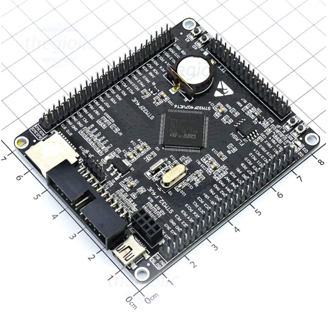

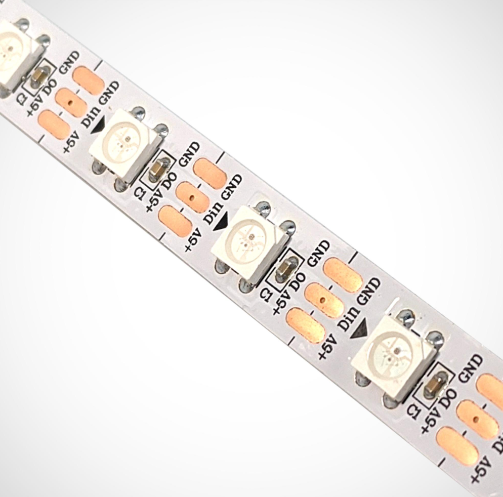

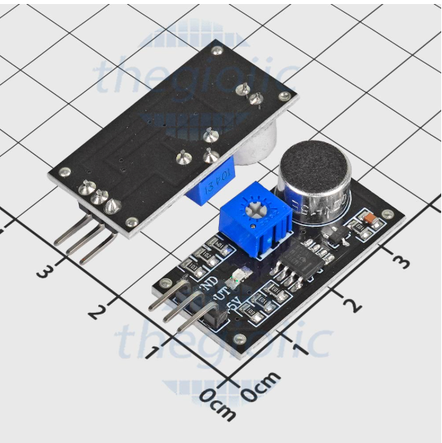

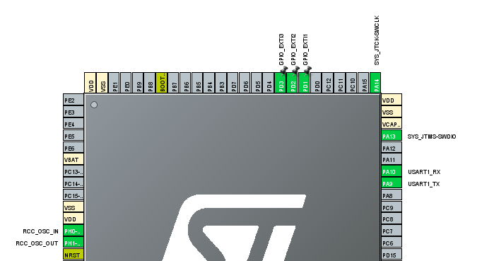

---

## 3.2 System Block Diagram

The complete system can be represented as:

```text
                       ┌──────────────────────┐
                       │   STM32F407VET6      │
                       │    Microcontroller   │
                       └──────────┬───────────┘
                                  │
              ┌───────────────────┼───────────────────┐
              │                   │                   │
              ▼                   ▼                   ▼
       ┌────────────┐      ┌────────────┐      ┌────────────┐
       │ Push       │      │ Audio      │      │ WS2812B    │
       │ Buttons    │      │ Sensor     │      │ 60 LEDs    │
       └────────────┘      │ LM393      │      └────────────┘
                           └─────┬──────┘
                                 │
                                 ▼
                               ADC
                                 │
                                 ▼
                               FFT
```

The STM32 receives user input through push buttons, receives audio information from the sensor, processes the signal, and generates the appropriate LED data.

---

## 3.3 MCU Configuration

The STM32F407VET6 is configured to provide the peripherals required by the system.

The project uses:

- GPIO
- External Interrupts
- ADC
- Timer/PWM
- DMA
- UART
- Clock system

The system configuration and pin assignment are developed using STM32CubeMX / STM32CubeIDE.

### System configuration

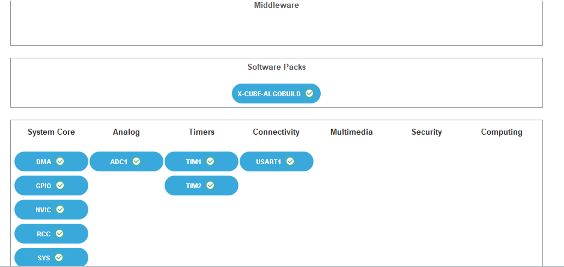

### Pinout

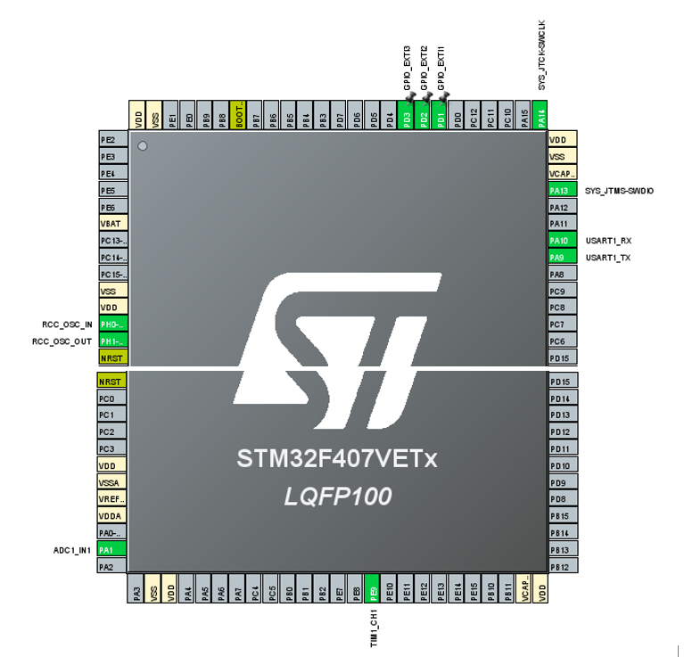

### Clock configuration

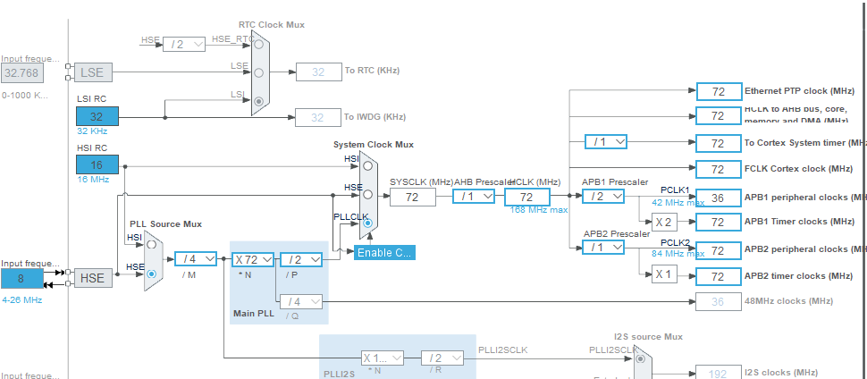

---

## 3.4 LED Control Interface

The WS2812B strip is controlled through a single data line.

The basic architecture is:

```text
STM32
  │
  │ PWM + DMA
  ▼
WS2812B DIN
  │
  ▼
LED 1 → LED 2 → LED 3 → ... → LED 60
```

The project uses **PWM + DMA** to generate the required WS2812B timing while reducing CPU workload.

For 60 LEDs:

\[
60\times24=1440\text{ data bits}
\]

The transmission buffer therefore contains the PWM representation of these bits plus additional slots used to create the reset interval.

---

## 3.5 Audio Input

The audio sensor provides an analog signal to the STM32 ADC.

```text
Sound
  │
  ▼
Microphone / Audio Sensor
  │
  ▼
LM393 Module
  │
  ▼
ADC
  │
  ▼
Digital Samples
  │
  ▼
DSP / FFT
```

The audio data can then be analyzed in two different ways:

1. **Amplitude analysis** — determines how loud the sound is.
2. **Frequency analysis** — determines which frequency components are dominant.

---

## 3.6 Timer, PWM and DMA

The LED communication requires accurate timing.

The project therefore uses PWM to generate the waveform and DMA to continuously feed the PWM data buffer to the timer.

Conceptually:

```text
LED Color Data
      │
      ▼
PWM Encoding
      │
      ▼
PWM Buffer
      │
      ▼
DMA
      │
      ▼
Timer / PWM Channel
      │
      ▼
WS2812B Data Line
```

The report specifies a PWM frequency of approximately **800 kHz**, corresponding to a bit period of approximately **1.25 µs**. fileciteturn5file0L279-L305

---

# CHAPTER 4 — PROGRAMMING AND ALGORITHMS

## 4.1 Main Program Flow

The main program initializes the MCU peripherals and then continuously executes the selected LED mode.

The system supports two major operating modes:

```text
                    START
                      │
                      ▼
              Initialize MCU
                      │
                      ▼
            Initialize Peripherals
                      │
                      ▼
               Read User Mode
                      │
          ┌───────────┴───────────┐
          ▼                       ▼
      No Music                 Music Mode
          │                       │
          ▼                       ▼
   LED Effects             Audio Processing
          │                       │
          └───────────┬───────────┘
                      ▼
                 Update LEDs
                      │
                      ▼
                    LOOP
```

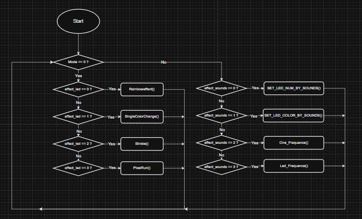

---

# 4.2 WS2812B Color Data Transmission

The LED-control algorithm converts the color value of each LED into a PWM waveform.

Each LED requires:

\[
24\text{ bits}=8G+8R+8B
\]

The data is sent in **GRB order**.

### Bit encoding

```text
Color Bit
   │
   ├── 1 ──► Longer HIGH pulse
   │
   └── 0 ──► Shorter HIGH pulse
             │
             ▼
          PWM Output
```

The report uses approximately:

```text
Bit 1 → HIGH ≈ 0.8 µs
Bit 0 → HIGH ≈ 0.4 µs
Bit period ≈ 1.25 µs
```

After all LEDs are transmitted, additional LOW PWM slots generate the reset interval. fileciteturn5file0L279-L305

---

# 4.3 Button / External Interrupt Control

The system uses external interrupts to detect button presses.

The buttons are used to:

- Change the LED effect.
- Adjust effect speed.
- Switch between normal lighting and music-reactive mode.

### Button-control flow

```text
Button Press
     │
     ▼
External Interrupt
     │
     ▼
Interrupt Callback
     │
     ├── Mode Button
     │      └── Change Effect
     │
     ├── Speed Button
     │      └── Change Speed
     │
     └── Music Button
            └── Toggle Music Mode
```

The report describes the interrupt callback as the mechanism for changing the effect, adjusting speed, and switching between non-music and music modes. fileciteturn5file0L306-L315

---

# 4.4 Non-Music LED Effects

## 4.4.1 Rainbow Effect

The Rainbow Effect assigns colors across the LED strip according to the RGB color spectrum.

The color distribution moves over time, producing the visual effect of a moving rainbow.

### Algorithm

```text
Start
  │
  ▼
Initialize Effect Step
  │
  ▼
For LED 0 → 59
  │
  ▼
Calculate Color Index
  │
  ▼
Select RGB Color
  │
  ▼
Write LED Color
  │
  ▼
Increase Effect Step
  │
  ▼
Repeat
```

The 60 LEDs are divided into three 20-LED regions, and the colors cycle through red, green, and blue. fileciteturn5file0L316-L335

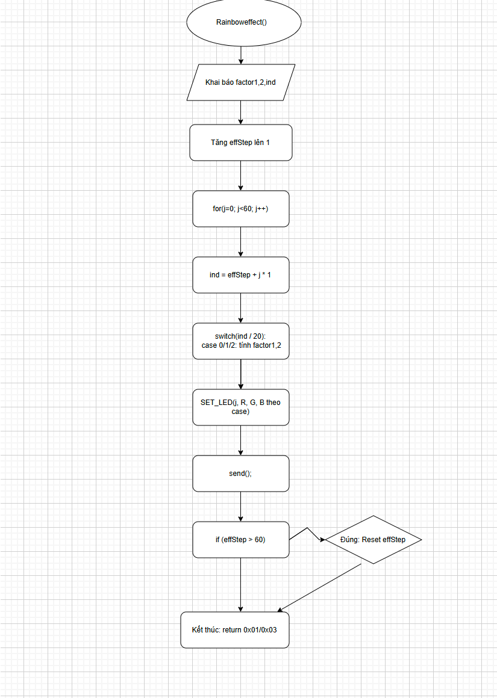

---

## 4.4.2 Single Color Change

The Single Color Change effect gradually increases the brightness of the primary colors.

The sequence is:

```text
Red
 │
 ▼
Green
 │
 ▼
Blue
 │
 ▼
Red
 │
 ▼
...
```

Each selected color increases from approximately 0 to 255 before the algorithm switches to the next color.

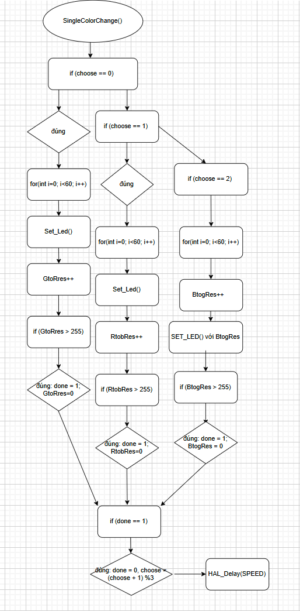

---

## 4.4.3 Strobe Effect

The Strobe Effect combines gradual color increase with a flashing stage.

### Processing flow

```text
Select Color
    │
    ▼
Increase Brightness
    │
    ▼
Brightness = Maximum?
    │
    ├── No ──► Continue
    │
    └── Yes
          │
          ▼
       LEDs OFF
          │
          ▼
     Select Next Color
          │
          ▼
        Repeat
```

The effect cycles through red, green, and blue while periodically turning the LEDs off to create the strobe effect. fileciteturn5file0L355-L367

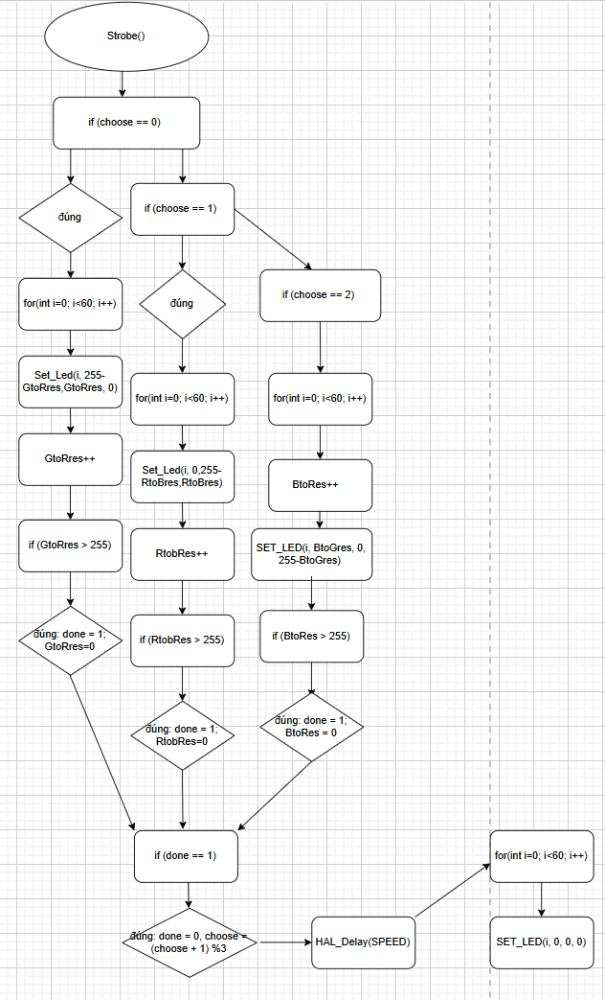

---

## 4.4.4 Pixel Run

Pixel Run creates a moving light point along the 60-LED strip.

At each step:

- One LED is illuminated.
- The remaining LEDs are turned off.
- The active position moves to the next LED.

```text
LED 1 → LED 2 → LED 3 → ... → LED 60
  ●        ●        ●              ●
```

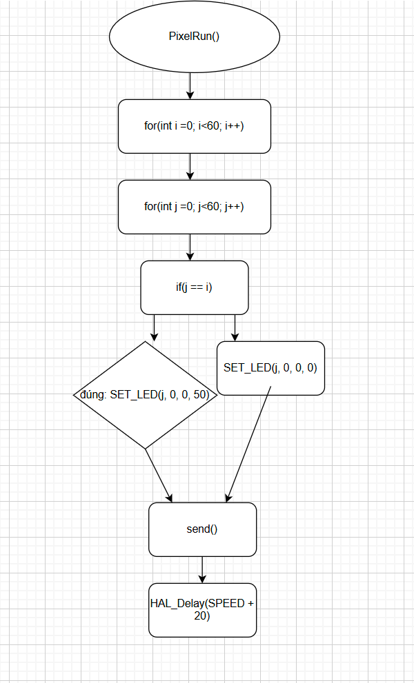

---

# 4.5 Music Visualization

The music mode combines ADC sampling, signal processing, FFT analysis, and LED control.

The overall processing chain is:

```text
Audio Signal
     │
     ▼
ADC Sampling
     │
     ▼
DMA Buffer
     │
     ▼
Signal Preprocessing
     │
     ▼
FFT
     │
     ▼
Magnitude Spectrum
     │
     ├───────────────┐
     ▼               ▼
Amplitude        Frequency
Analysis         Analysis
     │               │
     ▼               ▼
LED Number        LED Color /
or Brightness     Frequency Bands
     │               │
     └───────┬───────┘
             ▼
         WS2812B LEDs
```

---

# 4.6 Dominant Frequency Detection

The dominant-frequency algorithm determines the strongest frequency component of the audio signal.

### Processing steps

1. Acquire analog audio samples through ADC.
2. Convert samples to numerical data.
3. Perform FFT.
4. Calculate the magnitude spectrum.
5. Search for the maximum magnitude.
6. Convert the corresponding FFT bin to frequency.

The project uses:

| Parameter | Value |
|---|---:|
| FFT size | 1024 |
| Sampling rate | 44.1 kHz |
| Nyquist frequency | 22.05 kHz |
| FFT result | Complex spectrum |
| Output | Dominant frequency |

The report specifies `FFT_SIZE = 1024` and `SAMPLE_RATE = 44100 Hz`, with the Nyquist limit at half the sampling frequency. fileciteturn5file0L389-L416

### Algorithm

```text
ADC Samples
    │
    ▼
Normalize Samples
    │
    ▼
1024-point FFT
    │
    ▼
Calculate Magnitude
    │
    ▼
Find Maximum Magnitude
    │
    ▼
Find FFT Bin
    │
    ▼
Calculate Frequency
    │
    ▼
Dominant Frequency
```

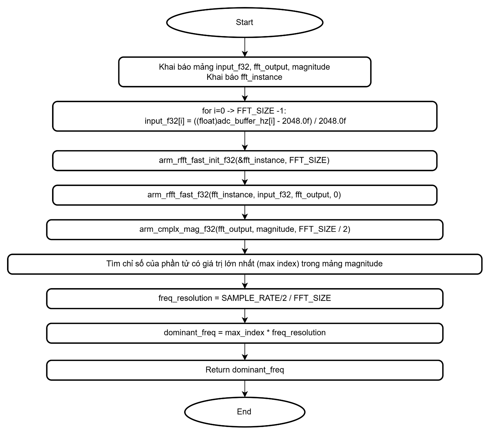

---

# 4.7 LED Number Based on Sound Amplitude

This algorithm controls the number of illuminated LEDs according to the loudness of the audio signal.

### Processing

```text
ADC Samples
     │
     ▼
Calculate RMS
     │
     ▼
Sound Volume
     │
     ▼
Map Volume → LED Count
     │
     ▼
Enable Required LEDs
     │
     ▼
Apply Rainbow Colors
```

The report uses multiple ADC samples, calculates the signal magnitude using RMS, maps the result to the number of LEDs to illuminate, and combines this with the rainbow effect. fileciteturn5file0L438-L450

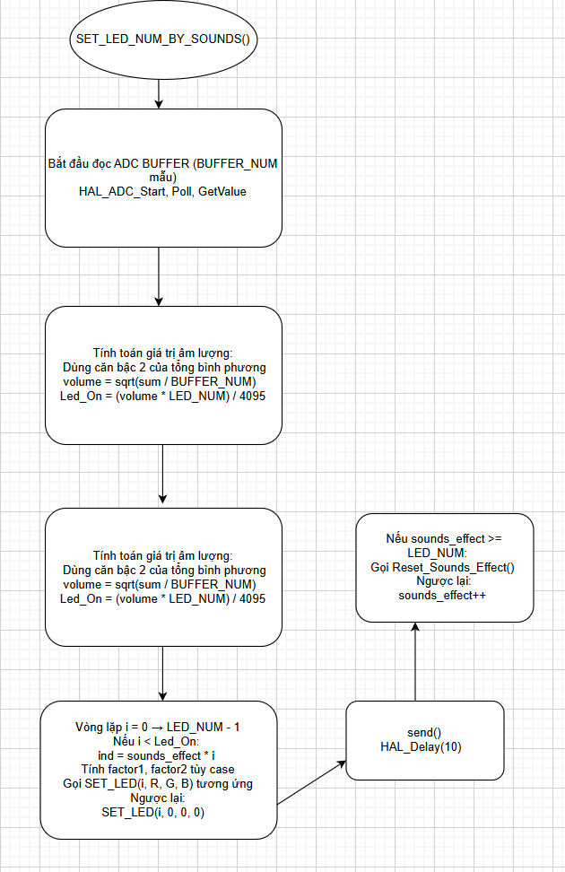

---

# 4.8 LED Color Based on Sound Amplitude

This algorithm maps sound intensity to LED color.

The intended color transition is:

```text
Low Volume                      High Volume
     │                                │
     ▼                                ▼
   Blue ─────────► Green ─────────► Red
```

The larger the sound amplitude, the warmer the resulting LED color becomes.

The algorithm normalizes the measured volume to a ratio and uses that ratio to interpolate between RGB color regions. fileciteturn5file0L455-L470

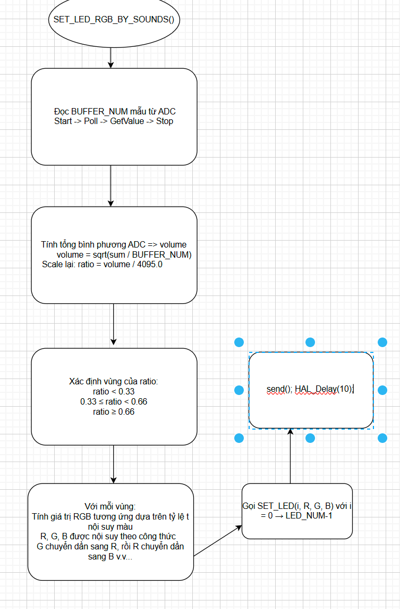

---

# 4.9 Single-Frequency Visualization

The `One_Frequence` mode uses the dominant frequency calculated from FFT.

### Processing flow

```text
ADC Sampling
     │
     ▼
FFT
     │
     ▼
Dominant Frequency
     │
     ▼
Map Frequency → LED Count
     │
     ▼
Display on LED Strip
     │
     ▼
Send Frequency through UART
```

The report describes using Timer 2 for sampling, obtaining the dominant frequency through FFT, mapping the result to the number of LEDs, and outputting the measured frequency through UART for observation/debugging. fileciteturn5file0L474-L484

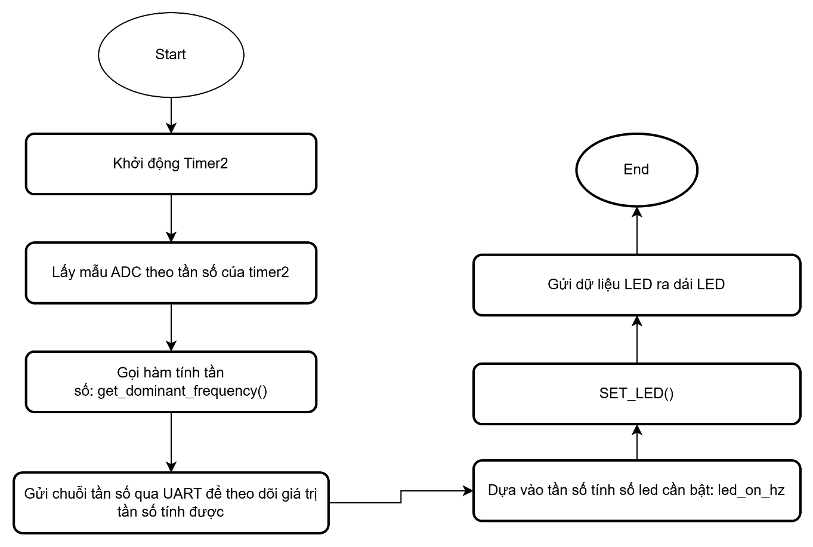

---

# 4.10 Three-Band Frequency Visualization

The most advanced music mode divides the frequency spectrum into three regions:

- **Bass**
- **Mid**
- **Treble**

The 60-LED strip is also divided into three regions:

```text
┌────────────────┬────────────────┬────────────────┐
│     BASS       │      MID       │     TREBLE     │
│    20 LEDs     │    20 LEDs     │    20 LEDs     │
│     BLUE       │     GREEN      │      RED       │
└────────────────┴────────────────┴────────────────┘
```

### Processing flow

```text
                  Audio Signal
                       │
                       ▼
                     ADC
                       │
                       ▼
                      FFT
                       │
                       ▼
              Magnitude Spectrum
                       │
        ┌──────────────┼──────────────┐
        ▼              ▼              ▼
      BASS            MID           TREBLE
        │              │              │
        ▼              ▼              ▼
 Max Frequency    Max Frequency    Max Frequency
        │              │              │
        ▼              ▼              ▼
   Blue LEDs      Green LEDs       Red LEDs
    0–19          20–39            40–59
```

For each band, the algorithm finds the strongest frequency component and uses its magnitude to determine LED brightness. The report divides the 60 LEDs into three groups of 20, with blue for bass, green for mid, and red for treble. fileciteturn5file0L489-L509

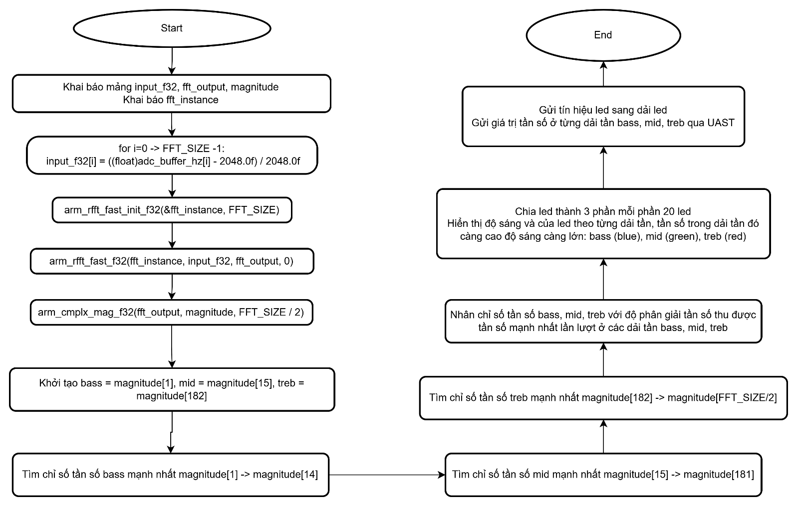

---

# 4.11 Complete Algorithm Overview

The complete project can be summarized by the following architecture:

```text
                         ┌───────────────┐
                         │     START     │
                         └───────┬───────┘
                                 │
                                 ▼
                    ┌──────────────────────┐
                    │ Initialize STM32     │
                    │ GPIO / ADC / Timer   │
                    │ DMA / UART / PWM     │
                    └──────────┬───────────┘
                               │
                               ▼
                     ┌──────────────────┐
                     │ Select LED Mode  │
                     └────────┬─────────┘
                              │
              ┌───────────────┴────────────────┐
              │                                │
              ▼                                ▼
       ┌─────────────┐                 ┌──────────────┐
       │ No Music    │                 │ Music Mode   │
       └──────┬──────┘                 └──────┬───────┘
              │                               │
       ┌──────┼─────────┐              ┌──────┴─────────┐
       ▼      ▼         ▼              ▼                ▼
    Rainbow Single   Strobe/        Volume          Frequency
             Color   Pixel Run      Analysis         Analysis
                                      │                │
                                      ▼                ▼
                                 LED Count       FFT / Spectrum
                                      │                │
                                      └───────┬────────┘
                                              ▼
                                      Update WS2812B
                                              │
                                              ▼
                                            LOOP
```

---

# Hardware–Software Interaction

The project combines low-level MCU peripherals with software algorithms:

| Hardware / Peripheral | Role |
|---|---|
| **STM32F407VET6** | Executes the application and DSP algorithms |
| **GPIO** | Button and control signals |
| **EXTI** | Detects button presses |
| **ADC** | Samples audio |
| **DMA** | Transfers ADC/PWM data with low CPU overhead |
| **Timer / PWM** | Generates WS2812B timing |
| **UART** | Debugging and frequency monitoring |
| **WS2812B** | Displays RGB effects and music visualization |

---

# Key Parameters

| Parameter | Value |
|---|---:|
| MCU | STM32F407VET6 |
| LED type | WS2812B |
| Number of LEDs | 60 |
| LED data format | 24-bit GRB |
| WS2812B data rate | ≈ 800 kHz |
| WS2812B bit period | ≈ 1.25 µs |
| Reset time | ≥ 50 µs |
| FFT size | 1024 |
| ADC sampling rate | 44.1 kHz |
| Nyquist frequency | 22.05 kHz |
| Frequency bands | Bass / Mid / Treble |
| LED allocation | 20 LEDs per band |

---

# Repository Structure

A recommended GitHub structure is:

```text
.
├── README.md
├── images/
│   ├── image4.png
│   ├── image5.png
│   ├── image6.png
│   ├── image11.png
│   ├── image12.png
│   ├── image13.png
│   ├── image14.png
│   ├── image16.png
│   ├── image21.png
│   ├── image24.png
│   ├── image27.png
│   ├── image29.png
│   ├── image31.png
│   ├── image34.png
│   ├── image37.png
│   ├── image39.png
│   └── image42.png
└── ...
```

The `images` directory should be placed at the **same level as `README.md`**.

---

# Demo

The project report provides a demonstration video of the implemented system:

**[Demo Video](https://drive.google.com/file/d/1pdINrIJIYEZ2lMB8yEEwDSlJpHKLOJkq/view?usp=drive_link)**

The demo covers the operation of the STM32-controlled WS2812B LED system and its music-reactive modes. fileciteturn5file0L510-L517
